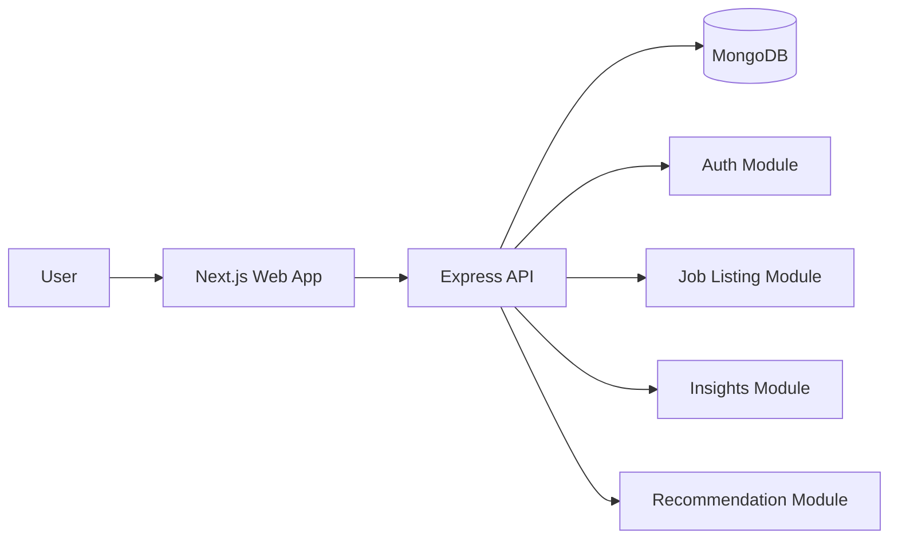

# JobPost

JobPost is a monorepo for a job discovery platform with a Next.js web app and an Express API backed by MongoDB.

## Apps and Packages

- `apps/web`: Next.js app (App Router)
- `apps/apis`: Express API server (TypeScript, MongoDB)
- `packages/ui`: shared UI primitives
- `packages/eslint-config`: shared ESLint configs
- `packages/typescript-config`: shared TS configs

## Requirements

- Node.js >= 18
- pnpm >= 9
- MongoDB connection string

## Quick Start

1) Install dependencies

```bash
pnpm install
```

2) Configure environment variables

Create `apps/apis/.env`:

```bash
DB=mongodb+srv://<user>:<password>@<cluster>/<db>
```

3) Start dev servers

```bash
pnpm dev
```

The web app runs on `http://localhost:3000` and the API on `http://localhost:4000`.

## Scripts

- `pnpm dev`: run all apps in dev mode with Turborepo
- `pnpm build`: build all packages
- `pnpm lint`: lint all packages
- `pnpm check-types`: typecheck all packages
- `pnpm format`: format `ts`, `tsx`, `md`

You can scope commands to a single app:

```bash
pnpm --filter web dev
pnpm --filter apis build
```

## API Overview

Base URL: `http://localhost:4000`

- `GET /health`: health check
- `POST /v1/auth/*`: authentication endpoints
- `/v1/listing/*`: job listing endpoints
- `/v1/feed/*`: insights endpoints
- `/v1/recommendation/*`: recommendations endpoints

## High-Level Design (HLD)

### Components

- **Web App**: Next.js UI for browsing jobs, insights, and profile pages.
- **API**: Express REST API exposing domain modules for auth, job listings, insights, and recommendations.
- **Database**: MongoDB for persistence via Mongoose models.

### Data Flow

1) The web app calls REST endpoints on the API server.
2) The API validates requests, runs module logic, and queries MongoDB.
3) The API returns JSON payloads to the web app for rendering.

### Architecture Diagram



## Project Structure

```
apps/
	apis/            # Express API
	web/             # Next.js web app
packages/
	ui/              # Shared UI components
	eslint-config/   # ESLint presets
	typescript-config/ # TS presets
```
